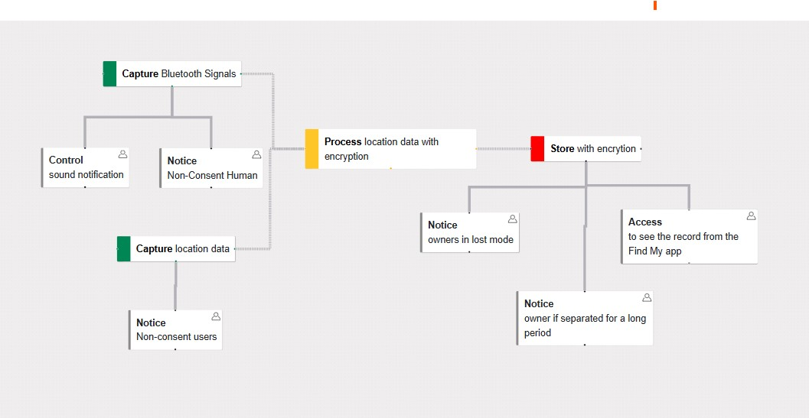
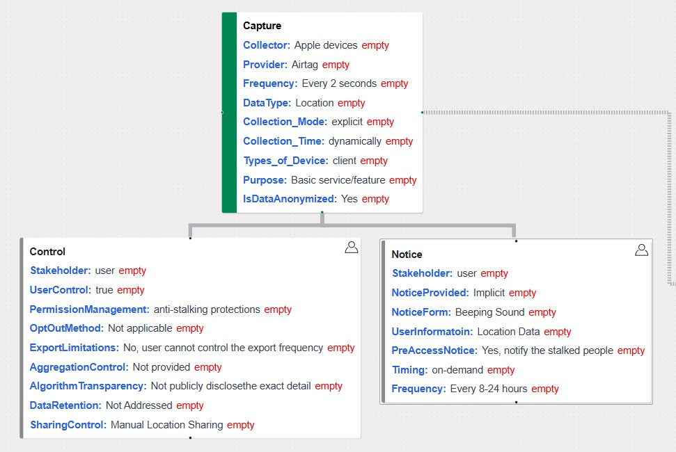
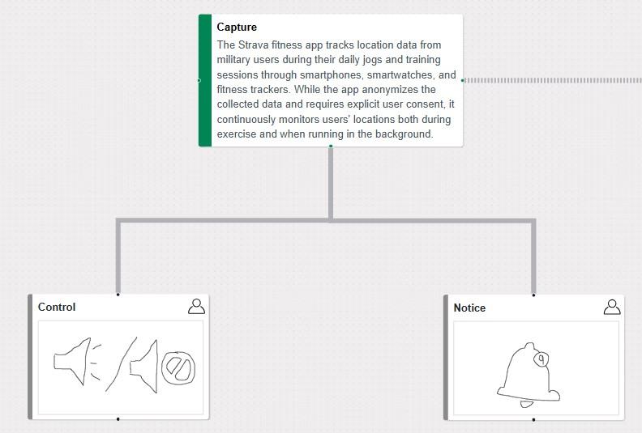

# Verb-Based Dataflow Diagram for Privacy Design

## Contributors
- **Max Yuen Sum Wong** (<y6wong@ucsd.edu>)
- **Zichen Yu** (<ziy015@ucsd.edu>)
- **Chris Yuen Kei Wong** (<ykw001@ucsd.edu>)

## Section and Mentor
- **Section:** B09  
- **Mentor:** [Haojian Jin](https://www.haojianj.in/home.html)

## Resources
- **Code Repository:** [GitHub - PrIDE-web](https://github.com/DataSmithLab/PrIDE-web/tree/master)
- **Paper:** [Project Paper](https://drive.google.com/file/d/1IRKbKV3r8OxFjIFqsD_eKQoeYOBJIJnR/view?usp=sharing)

## Introduction
In an era where data privacy is paramount, the tools we use to visualize data flows must evolve to meet modern challenges. Traditional data flow diagrams tend to adopt a noun-based approach, framing systems primarily as collections of devices and static components. This method often omits essential details—such as data collection methods, processing steps, storage durations, and other contextual metadata—leaving developers with an incomplete picture of how sensitive information is managed. Moreover, reliance on device-specific modules (e.g., phones, computers, IoT devices) restricts flexibility, especially in today’s heterogeneous technological environments.

Our work, building on insights from the paper "Verb-Based Dataflow Diagram for Privacy Design," introduces a transformative shift: focusing on the actions—the verbs—that define data actions, and stakeholder interactions. By centering on data actions (like collecting, processing, sharing, and storing), we capture a more dynamic and comprehensive view of data flows. This verb-based approach not only details the specific operations influencing data privacy but also integrates critical metadata (such as collection types and data retention periods) directly into each enumerable property of the diagram.

Designed with developers in mind—particularly those engaged in product development and decision-making—this method addresses common challenges faced with existing tools. It empowers teams to visualize and communicate complex data processes more clearly and accurately, thereby fostering greater transparency and trust. Ultimately, by shifting from static, device-centric diagrams to a dynamic, action-oriented paradigm, our approach enables more precise design and robust privacy compliance in an increasingly data-driven world.

---

## Method 

### Layer 1: Data Action Nodes

**Purpose:**  
Focuses on defining core data actions such as data collection, storage, processing, and usage. Developers can customize nodes to include detailed metadata.

**Features:**
- **Node Creation:**  
  - **Data Collection:** Points where data is gathered.  
  - **Data Storage:** Specifies storage location and security (e.g., encryption status).  
  - **Data Processing:** Describes transformations or analysis.  
  - **Data Usage:** Outlines purposes for which data is used.  

- **Node Editor:**  
  - Predefined options for metadata like storage period, purpose, information type, and encryption.  
  - Free-text boxes for additional descriptions.

- **Edges:**  
  - Represent one-way data flows between nodes.

**Results:**
- Structured representation of data actions improves transparency.  
- Customizable nodes support compliance with privacy regulations.  
- Enhanced usability with a minimap for navigation.  
- Provides a foundation for Layer 2 interactions.

---

### Layer 2: Data Interaction Nodes

**Purpose:**  
Represents interactions between users, stakeholders, and systems, focusing on how data is accessed, influenced, or controlled.

**Predefined Interaction Nodes:**
- **Consent:** User permissions for data actions.  
- **Influence:** Points where users can affect data processing.  
- **Request:** Data access or deletion requests.  
- **Audit:** Monitoring data usage for compliance.  
- **Notice:** Informing users about data practices.  
- **Perform:** Automated tasks involving data.

**Results:**
- Enhances privacy visualization by mapping user interactions explicitly.  
- Supports a range of privacy regulations with predefined and customizable nodes.  
- Improves stakeholder awareness by linking actions to accountability.  
- Automated positioning of nodes for clarity and readability.

---

### Layer 3: Unenumerable Details for Storytelling

**Purpose:**  
Captures subjective, narrative-driven elements that provide context for data actions and user journeys, enhancing the structured layers.

**Features:**
- Describes the purpose, context, stakeholders, and risks for each data action.  

**Drawboard for User Journey Mapping:**
  - Visual tool to map user experiences and privacy decisions.  
  - Connects devices, data actions, and interactions from a user perspective.

**Open-ended Storytelling:**
  - Accommodates qualitative details beyond predefined properties.  
  - Focuses on conveying the full context of data flows and privacy practices.

**Results:**
- Enriches data action nodes with detailed narratives.  
- Encourages iterative development with a focus on user experience.  
- Fosters a comprehensive understanding of privacy practices.

## Add-on Features

### Threat Analysis Table
The Threat Analysis Table extends the Privacy Storyboard platform, helping developers assess privacy risks in data workflows. It identifies, categorizes, and visualizes threats linked to data actions and interactions, allowing developers to proactively address risks early in the design process. 

Key threat categories include:
- **Surveillance:** Excessive tracking or monitoring.
- **Induced Disclosure:** Pressure to share unnecessary information.
- **Insecurity:** Security lapses risking trust or financial loss.
- **Unanticipated Revelation:** Accidental exposure of sensitive data.
- **Re-identification:** Linking anonymized data back to individuals.
- **Stigmatization:** Negative social impacts from data use.
- **Discrimination:** Biased treatment due to data processing.
- **Exclusion:** Denial of services based on data decisions.
- **Unwanted Aggregation:** Invasive inferences from combined data.
- **Breach of Confidentiality:** Unauthorized data access or leaks.

This feature promotes responsible and secure data practices by integrating privacy risk assessments into the design process.

### User Journey Map / Noun-Based Representation Feature
The user journey map, or noun-based representation, consolidates data flow information from multiple layers into a cohesive visualization. It highlights key data actions like collection, storage, processing, and sharing with intuitive icons and clear relationships between nodes. 

This streamlined view helps users quickly understand system-wide data flows, identify bottlenecks or privacy risks, and make informed design decisions.

---

## Discussion
The current approach introduces a layer 2 schema for data actions and interactions to generalize privacy design considerations. However, this schema might not fully capture all industry practices, indicating the need for further refinement through industry surveys and case studies.

A key challenge is the manual construction of dataflow diagrams, which is time-consuming. A potential solution is integrating **Privacy Akinator**—an intelligent system that guides developers through privacy considerations using a dynamic Q&A approach based on the 4W1H methodology and FIPP’s eight dimensions. This system could automate privacy assessments, reducing manual effort and improving efficiency.

---

## Conclusion
This paper presents a novel verb-based dataflow diagram approach that focuses on dynamic data actions and stakeholder interactions, providing a structured view of how data is collected, stored, processed, and used. 

The integration of features like the **Threat Analysis Table** and **User Journey Map** enhances transparency and accountability in system design, helping developers align with regulations such as GDPR and CCPA. This method not only ensures compliance but also strengthens privacy resilience against emerging threats.

### Actual Page of the Application 

[PrivacyVerb Application](https://privacyio-web-n87a.vercel.app/)